# MFlowy 研究流（Research Flow）

> 面向用户的 ML 方法论主脊：从原始数据到可解释模型的完整决策链路。四篇按研究时间线排列，可按需跳读。工具层面的能力以 MCP `tools/list` 下发的 schema 为准（docstring 即文档）；文中标注的平台模块均为已注册能力（YAML `module:` 值）。

## 总览：研究主线


每篇回答一个科学问题；后篇依赖前篇结论。任何一篇的结论不成立，回退上一篇，而不是在当前篇内硬调。

## 科学决策总纲

以下五律贯穿全部四篇，是每个具体判据的上位原则。与具体判据冲突时，以五律为准。

1. **划分先行**——测试集是一次性资源。任何由数据计算的统计量（填充值、缩放参数、编码表、目标编码均值）只能来自训练折；测试集只在最终评估触碰一次。违反即 CV 泄漏：指标虚高，且高得越漂亮越不可信。
2. **基线参照**——"好不好"是相对命题。复杂模型的每一点收益必须相对参照系度量；无参照系的单模型指标没有决策价值。平台的默认参照系是**多模型同场对比**（见第二篇），而非任何单一模型。
3. **不确定性量化**——单次评估只是从"该模型在该数据上"抽的一个样本。结论必须带离散度（重复 CV 的折间分布）；模型间差距小于折间波动时，判"无显著差异"，而不是强行排名。
4. **单一变更**——一次实验只改一个决策变量（特征集 / 预处理 / 模型 / 超参），其余冻结。实验命名承载该变量，使每次对比可归因。同时改两处，收益无法归因，实验作废。
5. **可复现**——固定随机种子；每次实验的 YAML 配置与数据血缘（步骤间输入依赖 tag）由平台自动记录，任何结论必须能被第三人重放。

---

# 第一篇 · 数据分析可视化决策树

> 从拿到原始数据到"可以建模"：看什么图、图中表现意味着什么、采取什么行动。所有预处理决策**只依据训练集统计**（总纲第 1 条）。

---

### 全局流程


平台落点：第 1–2 步用 `data_profile`（statistic 模块 `profile`，输出逐列画像）；第 4 步用 `eda`（编排 effect_size 统计 + 五张特征-目标关系图）；第 3 步的判据多数已内含在 profile 输出列中（skew、nunique、top_10）。

---

### 1. 初步检视——数据长什么样

**目的**：快速建立整体认知，确定任务类型与分析路径。判据全部来自 `data_profile` 输出的逐列画像。

#### 术语

| 术语 | 全称 | 含义 |
|---|---|---|
| 回归 | Regression | 目标变量为连续数值（如价格、温度、浓度） |
| 分类 | Classification | 目标变量为离散类别 |
| 二分类 | Binary Classification | 目标只有两个类别 |
| 多分类 | Multi-class Classification | 目标有三个及以上类别 |
| 基数 | Cardinality | 分类特征中唯一值的数量，即 profile 的 `nunique` |
| cardinality_ratio | — | profile 输出：nunique / √(非空数)。<1 倾向低基数类别候选；接近 √(n) 倾向 ID 型列 |
| is_id | — | profile 输出：非空值全唯一且非 float，严格判定为 ID 列 |
| is_constant | — | profile 输出：唯一值 = 1，常量列 |
| dtype | Data Type | 列的数据类型（int64 / float64 / object / datetime） |

#### 决策树

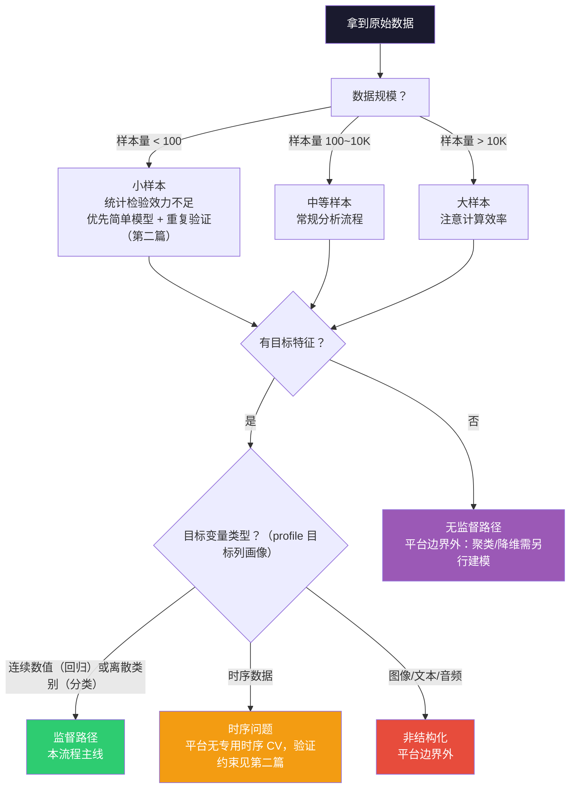

> 任务类型在平台内由目标列自动推理（REGRESSION / CLASSIFICATION，工具 `infer_task_type_by_statistic` 给出推理依据）。多目标列必须同为一种任务类型，异构目标（如一列回归一列分类）拆成不同训练分支。

#### 需要查看的信息（profile 输出 → 决策）

| 要了解的 | profile 输出 | 判读 |
|---|---|---|
| 数据规模 | 行数 × 列数（`df.info()`） | 样本量决定可选模型复杂度与验证法（第二篇） |
| 目标变量类型 | 目标列 dtype + nunique | 连续→回归；2 类→二分类；多类→多分类 |
| 特征类型构成 | 逐列 dtype | 全数值 / 全分类 / 混合，决定预处理流水线复杂度 |
| 类别分布 | 目标列 top_10 频次 | 严重不平衡→采样策略与指标选择（本篇 3.3 + 第二篇） |
| ID / 常量列 | is_id / is_constant | ID 列直接剔除（否则等于把行号当特征）；常量列见第 2 步 |
| 列级完整度 | 逐列 missing 计数与百分比 | 进入第 2 步缺失决策的主判据 |

---

### 2. 质量评估——数据能不能用

**目的**：在分析之前排除数据层面的问题，避免"垃圾进垃圾出"。

#### 术语

| 术语 | 全称 | 含义 |
|---|---|---|
| MCAR | Missing Completely At Random | 缺失与任何变量无关。最安全，删除或简单填充即可 |
| MAR | Missing At Random | 缺失与其他已观测变量有关，与自身未观测值无关。可用条件填充 |
| MNAR | Missing Not At Random | 缺失与自身未观测值有关（如低收入者不愿填收入）。最难处理，需领域知识 |
| CV 泄漏 | Data Leakage | 训练信息污染验证/测试（如重复行跨集、测试集统计量进入预处理），指标虚高 |
| 准常量特征 | Near-constant Feature | 某值占比 > 95% 的特征，几乎无区分力 |
| IQR | Interquartile Range | Q3 − Q1，对异常值鲁棒的离散度量 |

#### 缺失值决策（统一判据，全文唯一出处）

阈值是**工程约定**而非统计定律：样本量越大，同一缺失比例的填充代价越小，阈值可放宽。

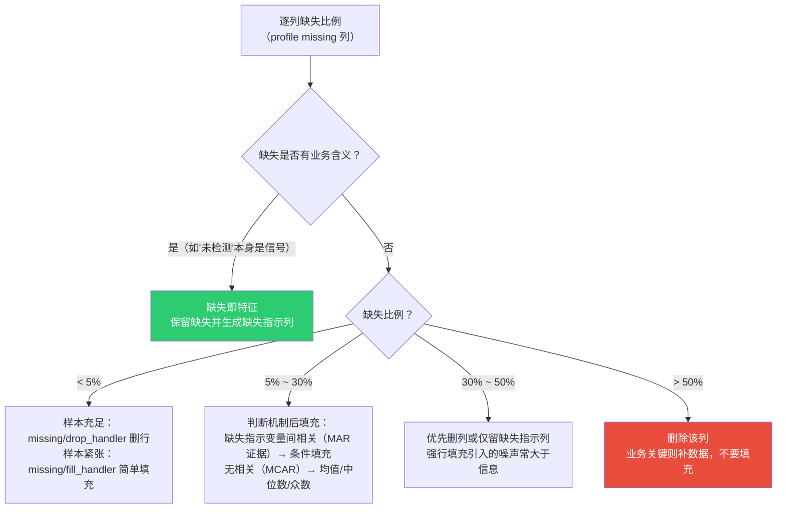

#### 其余质量项

| 检查项 | 判据 | 行动 | 平台落点 |
|---|---|---|---|
| 重复行 | duplicated 计数 | 删除——重复行跨训练/验证集即 CV 泄漏 | 预处理脚本 |
| 常量/准常量列 | is_constant；某值占比 > 95% | 删除——无区分力，徒增计算 | `filter/variance_filter` |
| 数值存为字符串 | dtype=object 但应为数值 | 转数值，注意脏字符 | 预处理脚本 |
| 类别存为整数 | dtype=int 但语义为类别 | 转类别，避免被当作有序数值 | 预处理脚本 |
| 带单位的数值 | "10 mg" 这类字符串 | 剥单位 | `unit/strip_units` |
| 行过滤 | 业务规则筛行（如剔除异常批次） | 显式过滤并记录 | `filter/common_filter` |

---

### 3. 单变量分析——每个特征什么形态

**目的**：逐个理解特征分布，为预处理选型提供依据。数值列的 skew / kurt 已在 profile 输出中。

#### 3.1 数值特征

| 术语 | 全称 | 含义 |
|---|---|---|
| KDE | Kernel Density Estimation | 核密度估计，直方图的连续版 |
| 右偏/左偏 | Skewness | profile 的 skew 列：\|skew\| > 1 提示需变换；kurt（超额峰度）> 0 提示尖峰厚尾 |
| Box-Cox | Box-Cox Transformation | 幂变换族，自动寻优 λ 使分布近正态，要求数据 > 0 |
| StandardScaler | Z-score 标准化 | (x−μ)/σ。假设近正态、无明显异常值 |
| RobustScaler | 鲁棒缩放 | (x−中位数)/IQR，对异常值不敏感 |
| Winsorize | 缩尾 | 极端值截断到百分位阈值，而非删除 |

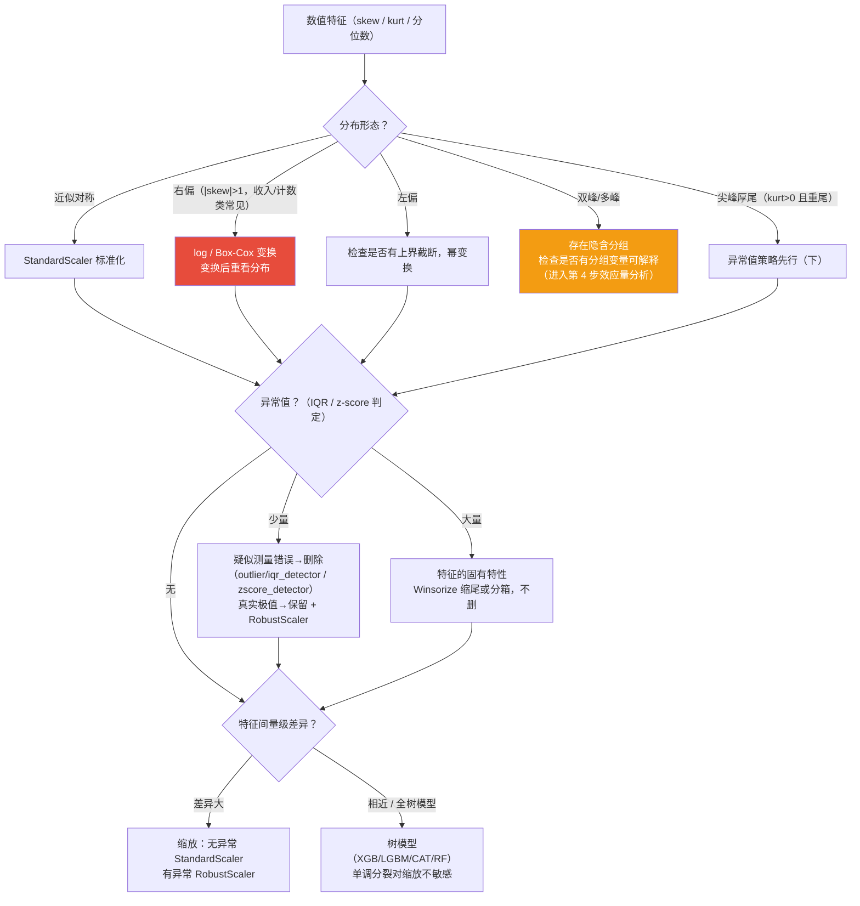

#### 3.2 分类特征

| 术语 | 全称 | 含义 |
|---|---|---|
| OneHot | 独热编码 | 每类别一列。低基数适用；高基数导致维度膨胀 |
| Ordinal | 有序编码 | 编码顺序由业务指定（小 < 中 < 大） |
| Target 编码 | Target Encoding | 用类别目标均值替代类别值。高基数有效，但**必须**在训练折内交叉计算（总纲第 1 条） |
| 频数编码 | Frequency Encoding | 用类别出现频率替代，无泄漏风险 |
| 罕见类别 | Rare Category | 占比 < 1% 的类别，模型难以学习，合并为 "Other" |

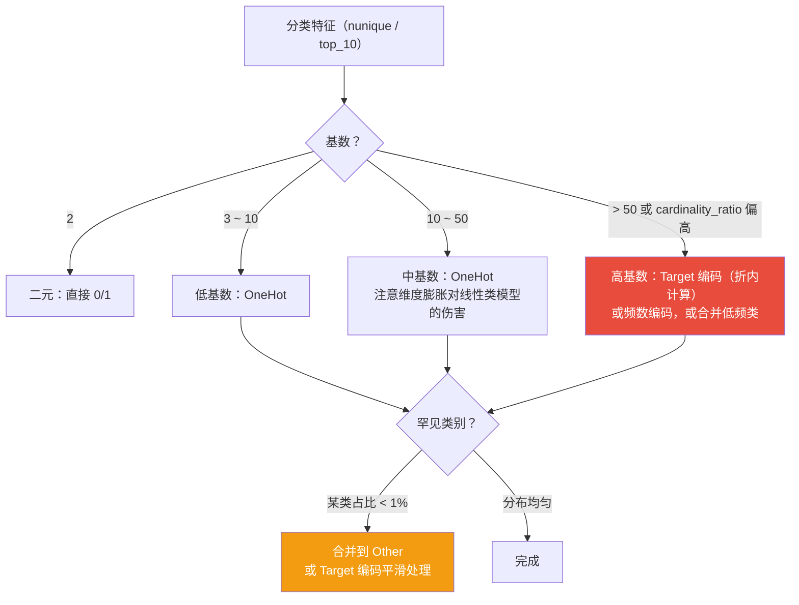

#### 3.3 目标变量

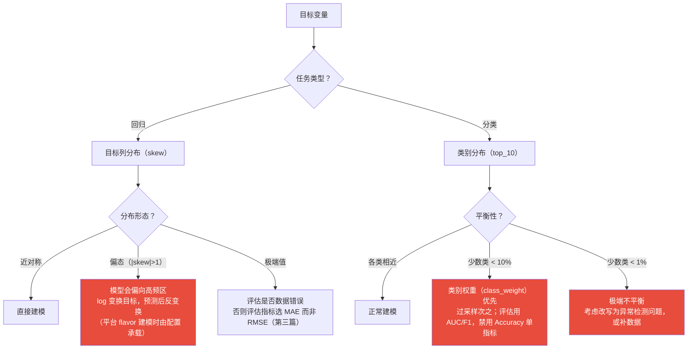

> 类别不平衡的处理位置在**模型与指标**（class_weight / 评估指标），而不是对数据盲目重采样——重采样改变训练分布，会让 CV 估计失真（验证折应保持原始分布）。采样只施加于训练折内部。

---

### 4. 多变量分析——特征之间什么关系

**目的**：理解特征间依赖与特征-目标关联，发现冗余、共线性和泄露嫌疑。平台落点：`eda` 工具一次编排本步全部统计与图。

#### 术语

| 术语 | 全称 | 含义 |
|---|---|---|
| Pearson r | Pearson Correlation | 线性关系强度 [-1,1]，假设近正态、无异常值 |
| Spearman ρ | Spearman Rank Correlation | 单调关系（不要求线性），用秩次计算，对异常值鲁棒 |
| 共线性 | Collinearity | 两特征高度相关（\|r\| > 0.9），其一可被替代 |
| VIF | Variance Inflation Factor | 某特征被其余特征线性解释的程度，> 10 提示严重共线性 |
| η² / Cramér's V | — | 效应量：分类特征对数值目标的方差解释比例 / 分类-分类关联强度 |
| LOWESS | Locally Weighted Scatterplot Smoothing | 局部加权散点平滑，看非线性趋势形状 |
| 虚假相关 | Spurious Correlation | 统计相关但无因果（共因驱动），高相关 + 低样本量时警惕 |

#### 决策树

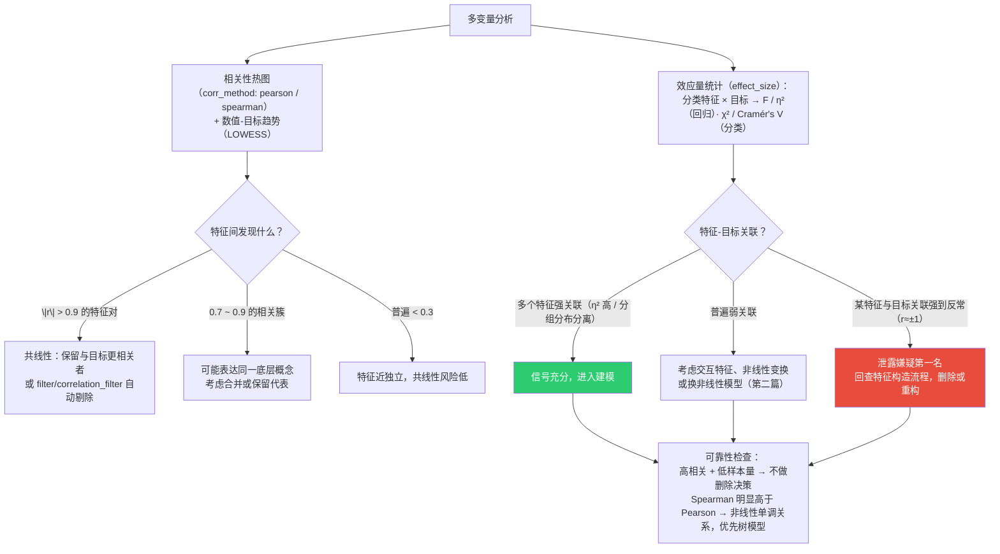

#### eda 工具的五张图与判读

| 图（module） | 回答的问题 | 关键信号 |
|---|---|---|
| `correlation_heatmap` | 特征间、特征-目标相关性全貌 | 高相关色块（共线性）；目标行/列整体浅色（弱信号） |
| `target_trend_by_numeric` | 数值特征→目标的关系形状 | 直线（线性）/ 曲线（非线性）/ 阶梯（阈值效应） |
| `target_separation_by_numeric` | 数值特征按目标类别的分离度 | 类别分布分离（强判别特征）/ 高重叠（弱特征） |
| `target_effect_by_category` | 分类特征→数值目标的组间效应 | 组间均值差与 η²（该特征值不值得编码进来） |
| `target_association_by_category` | 分类特征→分类目标的交叉关联 | Cramér's V 与列联结构 |

---

### 5. 就绪决策——可以建模了吗

**目的**：综合全部发现，形成"可以建模 / 还缺什么"的结论。逐项检查，任一未决则回退对应步骤。

| # | 检查项 | 未决时的回退 |
|---|---|---|
| 1 | 数据量是否支撑目标复杂度（<100 样本 = 只能简单模型） | 补数据，或接受低复杂度 |
| 2 | 缺失策略已定（第 2 步表） | 回质量评估 |
| 3 | 异常值已评估（删 / 留 / 缩尾） | 回单变量 |
| 4 | 缩放与编码策略已定（第 3 步） | 回单变量 |
| 5 | 共线性已处理或已决定容忍（树模型容忍度高） | 回多变量 |
| 6 | 目标变换已决定（偏态目标） | 回单变量 3.3 |
| 7 | 类别不平衡策略已定（权重/采样/指标） | 回单变量 3.3 |
| 8 | 泄露嫌疑特征已排查 | 回多变量 |

#### 分析结论记录模板

完成数据分析后形成书面结论（后续建模与评估全部以此为前提）：

| 维度 | 结论 | 待执行操作 |
|---|---|---|
| 数据规模 | （样本量 × 特征数，是否充足） | |
| 任务类型 | （回归 / 分类；平衡性） | |
| 缺失值 | （哪些列，什么策略） | |
| 异常值 | （哪些列，删/留/缩尾） | |
| 分布形态 | （哪些列需变换，什么变换） | |
| 缩放/编码 | （策略） | |
| 共线性 | （删除哪些列或容忍） | |
| 目标变量 | （是否变换；不平衡策略） | |
| 泄露排查 | （排查过什么，删了什么） | |
| 初步模型倾向 | （线性信号 or 非线性树模型） | |

---

# 第二篇 · 训练方法决策指南

> 根据数据分析结论选择训练方案：模型、验证方法与评估指标。

---

### 一、任务定型

平台监督任务只有两种：REGRESSION / CLASSIFICATION（由目标列自动推理，`infer_task_type_by_statistic` 输出推理依据）。无监督（聚类/降维）、图像/文本/音频、专用时序模型不在平台能力内——数据分析阶段即应识别并分流（第一篇 1）。

多目标列：一个训练分支只承载一种任务类型（多列同为回归=多输出回归，同为分类=多标签分类）；异构目标拆分支。

### 二、模型选型 = 对比实验

科学立场：**不先验地押注单一模型**。表格数据的理论（No Free Lunch）与实践共识是：哪种模型族最优是数据相关的经验问题，只能由受控对比回答。平台的对比机制服务于这一方法：YAML 中写多个 model 步（multi_model）时，建模工作流自动叠加预测散点、混淆矩阵与 Taylor 图做同场排名；五个 flavor 是否全上由 modeling_steps 决定——方法论上应当全上，胜者由数据定。

五个内置 flavor：`XGB` / `LGBM` / `CAT`（梯度提升族）、`RF`（bagging 树族）、`MLP`（神经网络）。

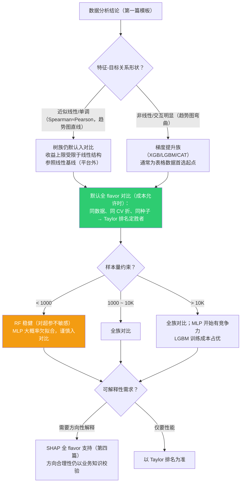

**配对对比纪律**（总纲第 2、3 条的落点）：所有 flavor 必须在**同一 CV 划分、同一随机种子**下评估——只有配对比较才能把模型间差异与折间波动分离；跨实验（不同划分）的指标直接比较大半是噪声。

**类别不平衡**：优先 class_weight / scale_pos_weight（模型内代价敏感），训练折内过采样次之；评估指标同步换（AUC/F1/PR，见第四步指标速查）。禁止在 CV 外全局重采样。

### 三、验证方法决策

平台内置九种 CV 模块，决策树按"先选族，再选变体"：

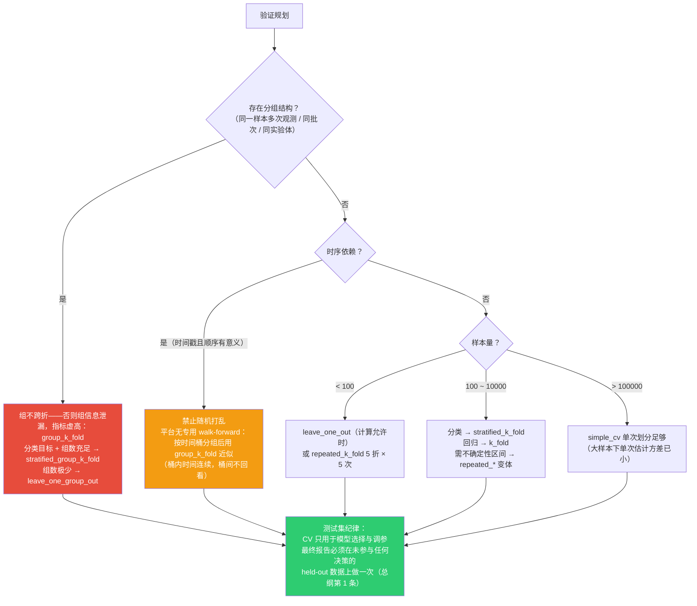

#### 验证速查表

| 样本量 | 推荐模块 | 理由 |
|---|---|---|
| < 100 | `leave_one_out` 或 `repeated_k_fold` | 最大化数据利用率 + 重复平抑方差 |
| 100 – 1000 | `repeated_stratified_k_fold`（分类）/ `repeated_k_fold`（回归） | 稳定估计 + 不确定性区间 |
| 1000 – 10000 | `stratified_k_fold` / `k_fold` | 效率与稳定性平衡 |
| 10000 – 100000 | `k_fold` 5 折 | 数据充足 |
| > 100000 | `simple_cv` | 单次划分方差已足够小 |
| 有分组结构 | `group_k_fold` / `stratified_group_k_fold` / `leave_one_group_out` | 组泄漏防线 |
| 时序 | 时间桶 + `group_k_fold`（近似） | 保序，禁止随机打乱 |

> 调参与最终评估混用同一 CV 会导致"选择偏差"（挑了对自己最有利的折），科学做法是嵌套两层或保留独立测试集；平台工作流中后者（held-out）为默认纪律。

### 四、评估指标速查

| 任务 | 类别平衡 | 推荐指标 | 理由 |
|------|---------|---------|------|
| 分类 | 平衡 | Accuracy 可用，仍报 AUC | |
| 分类 | 不平衡 | F1、AUC-ROC | Accuracy 被多数类主导 |
| 分类 | 极度不平衡 | AUC-PR（AP） | 比 ROC 对少数类更敏感 |
| 回归 | 常规 | RMSE / R² | 平台 Taylor 图主指标为归一化 RMSE 族 |
| 回归 | 有极端值 | MAE | RMSE 被极端误差主导 |
| 回归 | 相对误差重要 | MAPE | 注意真实值接近 0 时失效 |

### 五、决策因素优先级

```
1. 泄漏防线（分组/时序结构）  → 验证族选择，优先级最高
2. 任务类型                  → 分类/回归 → 指标族
3. 样本量                    → 模型复杂度上限 + 验证方法
4. 特征-目标关系形状          → 线性结构/非线性 → 对比重点
5. 类别平衡性                → 权重/采样 + 指标
6. 可解释性需求              → 全 flavor 可解释，影响的是解释成本而非选型
```

### 六、典型场景决策路径

**场景 1：用户流失预测（不平衡二分类）**
10000 样本 × 50 特征，流失率 5%。路径：分类 → `stratified_k_fold`（不平衡必须分层）→ 全 flavor 对比（class_weight 开启）→ AUC/F1 评估 → 胜者 SHAP 解释（第四篇）。禁项：全局 SMOTE 后再 CV；单看 Accuracy。

**场景 2：材料强度回归（偏态目标）**
2000 样本 × 20 数值特征，目标右偏。路径：回归 → 目标 log 变换（第一篇 3.3）→ `repeated_k_fold`（中样本取不确定性区间）→ Taylor 排名（rmse_total_norm）→ 残差分析查系统偏差（第三篇）。

**场景 3：多指标配方优化（多输出回归）**
目标 = 强度 + 成本两列（均连续）。路径：单分支多输出回归（任务类型一致）→ 对比全 flavor → Taylor 图按 (目标 × 模型) 分组同图排名 → 对胜者做逆向搜索（`inverse_optimization`）找最优配方输入。

---

# 第三篇 · 模型评估可视化决策树

> 从训练完成到部署决策：整体性能、训练诊断、CV 稳定性、误差深度分析。评估图的平台模块对照见本篇末速查表。

---

### 全局流程


### 术语表

| 术语 | 全称 | 含义 |
|---|---|---|
| R² | Coefficient of Determination | 模型解释目标方差的比例，[0,1]，越高越好 |
| RMSE | Root Mean Squared Error | 误差平方均值开方，对大误差敏感，与目标同单位 |
| MAE | Mean Absolute Error | 误差绝对值均值，对极端值鲁棒 |
| Taylor 图 | Taylor Diagram | 极坐标上同时展示各模型的标准差比（sigma_ratio）、与观测相关系数（correlation）、归一化 RMSE（rmse_norm/bias_norm/rmse_total_norm）——三者有解析关系，点位即综合战力 |
| rmse_total_norm | — | 平台 Taylor 主指标：总归一化误差，越小越好；`total_rank` 按其升序排名 |
| 过拟合 | Overfitting | 训练集好、新数据差（方差过大） |
| 欠拟合 | Underfitting | 训练与新数据都差（偏差过大） |
| 早停 | Early Stopping | 验证损失不再下降即停止训练 |
| 残差 | Residual | y_true − y_pred，理想时随机无模式 |
| 异方差性 | Heteroscedasticity | 残差方差随预测值变化（如预测越大误差越大） |
| 混淆矩阵 | Confusion Matrix | 实际 × 预测交叉表 |
| 精确率 | Precision | TP/(TP+FP)，预测为正中真为正的比例 |
| 召回率 | Recall | TP/(TP+FN)，真为正中被找到的比例 |
| F1 | F1 Score | P 与 R 的调和平均 |
| AUC | Area Under ROC Curve | 阈值无关的整体区分能力，0.5=随机 |
| 收敛 | Convergence | 损失趋稳不再显著下降 |

### 1. 整体性能评估——模型是否可用

**判据基线**：R² / RMSE / MAE（回归）、AUC / F1（分类）没有绝对及格线——**相对参照系**（总纲第 2 条）：与同场对比的其他模型、与业务最低要求、与文献基线。约定参考（非定律）：回归 R² > 0.7 且 RMSE 在业务阈值内为良好；分类 AUC > 0.8 为良好。

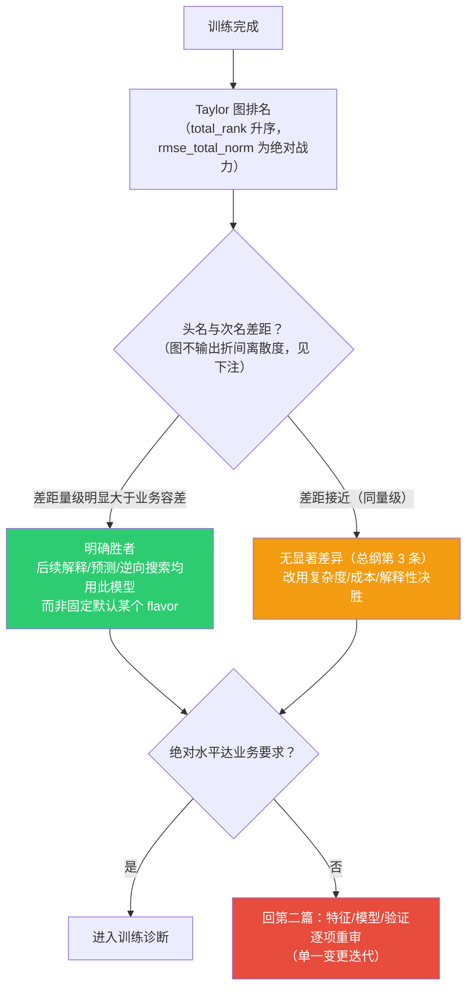

分类补充看混淆矩阵（`confusion_matrix`）：对角线集中=健康；特定类别对互混=特征不足以区分该对。

> **波动证据的获取方式**：Taylor 图池化全部折的预测后计算指标，不输出折间离散度；严格的“差距 vs 波动”检验需用 `repeated_*` CV 变体观察重复间波动，或导出逐折数据自行计算。当前图上的判定是量级判断（差距与业务容差对照），非显著性检验。

### 2. 训练过程诊断——拟合质量如何

平台落点：`loss_curve`（模型评估阶段自动产出）。一张图看三件事：**收敛性**（train loss 是否稳定下降）、**过拟合**（validation 是否持续低于 train 并发散/回升）、**折间稳定性**（细线带宽度大=对数据敏感）。前提：Val 曲线仅当 CV 划分产生独立验证段（如 `simple_cv`）时存在——`k_fold`/`stratified_k_fold` 只有 train/test 两段，此时无 Val 线，过拟合判读退化为 Train 曲线 + Train/Test 表现差（混淆矩阵/散点图与逐折指标）。

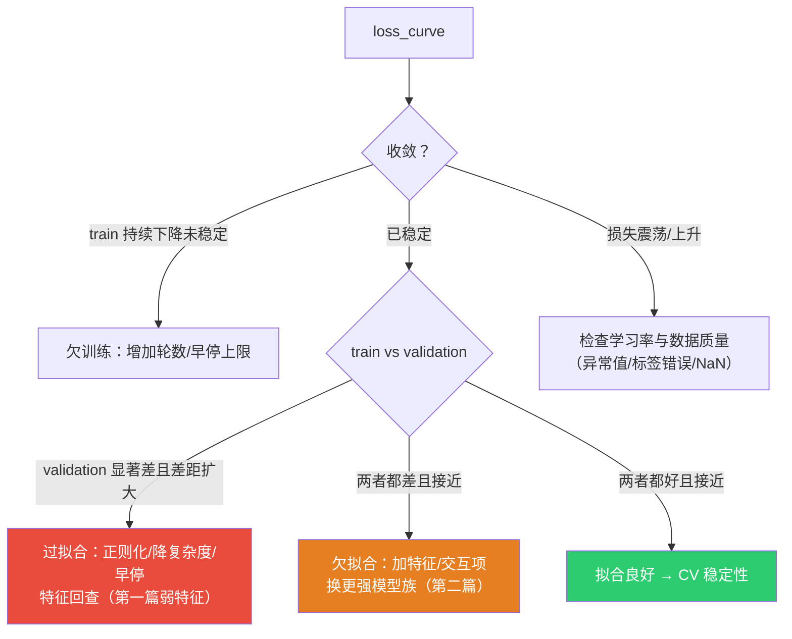

### 3. CV 稳定性分析——结论是否可信

判据（约定）：折间指标标准差 < 均值的 10% 为稳定；> 20% 为不稳定。`repeated_*` CV 下以重复间离散度为准。

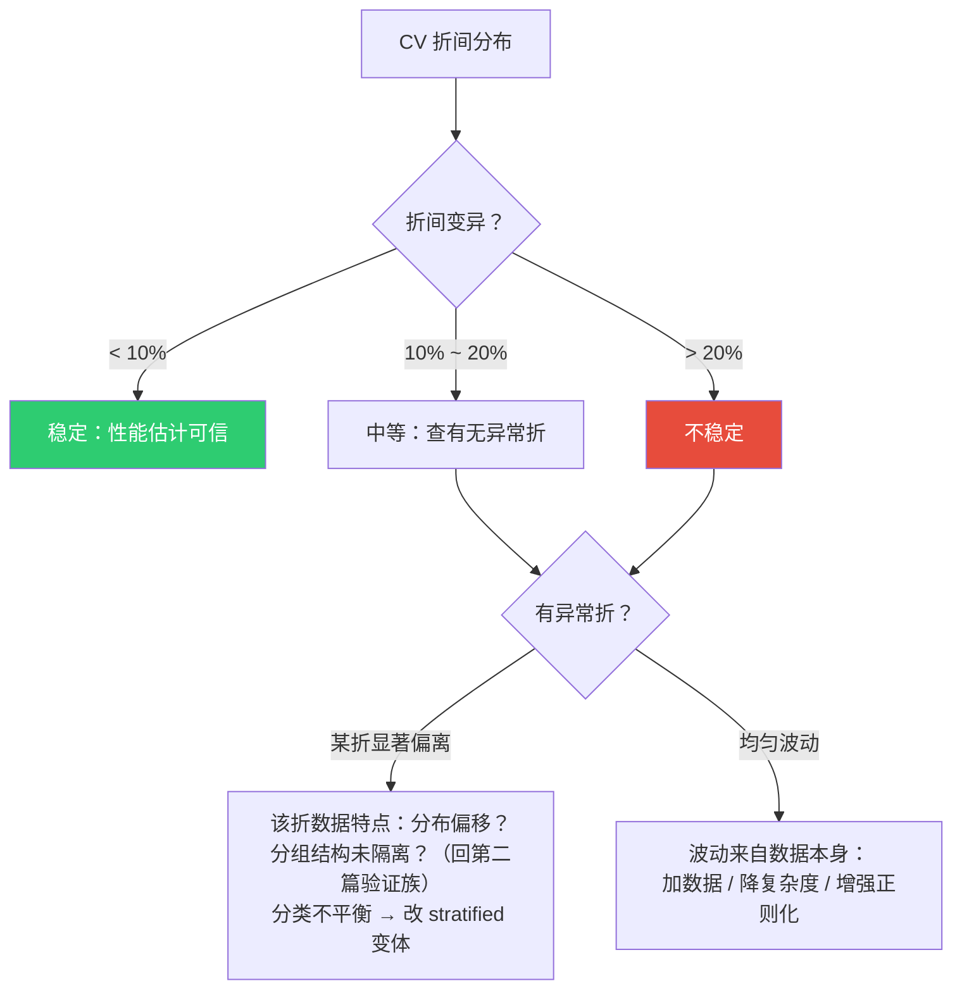

### 4. 误差深度分析——误差来自哪里

#### 4.1 回归（`residual_scatter` / `prediction_scatter` / `error_distribution`）

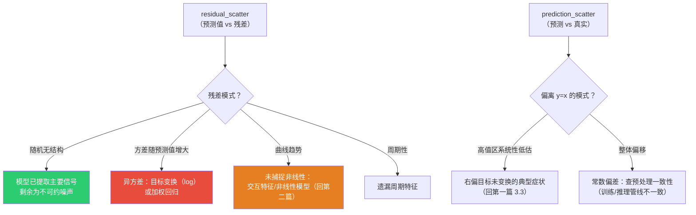

`error_distribution`：误差分布形状——双峰=两类样本（查分组变量），厚尾=极端误差样本需单独审查。

#### 4.2 分类（`confusion_matrix`）

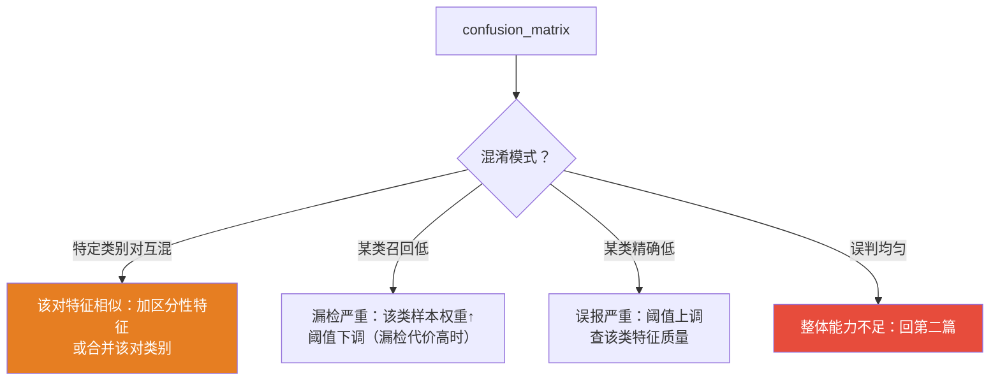

> 阈值调整属于部署决策：训练后按业务代价（漏检 vs 误报）在混淆矩阵/指标-阈值权衡上选取，不重训练。

### 决策点 × 平台模块速查

| 决策点 | 模块 | 说明 |
|---|---|---|
| 多模型综合排名 | `taylor_diagram` | sigma_ratio/correlation/rmse 族同图，total_rank 定胜者 |
| 预测-真实一致性 | `prediction_scatter` | 系统 bias 与高值低估 |
| 残差结构 | `residual_scatter` | 异方差/非线性/周期 |
| 误差分布形状 | `error_distribution` | 建模管线内部产出 |
| 分类混淆模式 | `confusion_matrix` | 类别对互混/单类失效 |
| 收敛与过拟合 | `loss_curve` | train/val + 折间带 |

---

# 第四篇 · 模型可解释性可视化决策树

> 用 SHAP 理解模型如何决策：全局重要性（`summary`）、影响方向（`dependence`）、单样本归因（`sample_waterfall`）。平台入口：`explanation` 工具编排前两者；`sample_waterfall` 为已注册模块，经 `modeling` 工具的自定义 steps 接入。解释对象应为 Taylor 排名的胜者模型（第三篇 1）——两个工具都要求显式传 `module=run_id`，即由调用方按排名选定，而非固定 flavor。

---

### 全局流程


### 术语

| 术语 | 全称 | 含义 |
|---|---|---|
| SHAP | SHapley Additive exPlanations | 博弈论特征归因：每个特征公平分得对预测的贡献 |
| SHAP 值 | — | 正值推高预测，负值压低；蜂群图上按特征值着色 |
| 基准值 | Base Value | 全特征贡献为零时的预测（近似训练均值） |
| 全局/局部解释 | Global / Local | 模型整体行为 vs 单个预测的归因 |
| 非单调关系 | Non-monotonic | 特征与预测非单向（U 型等），dependence 图可直读 |

### 1. 全局特征重要性——哪些特征主导

**判读**（`summary`：双轴蜂群——每点一个样本，横轴 SHAP 值，颜色=特征值高低，顶条为重要性）：

| 蜂群信号 | 含义 | 行动 |
|---|---|---|
| Top 特征符合领域知识 | 模型学到合理模式 | 可信，进入方向校验 |
| 意外特征冲顶 | **泄露嫌疑或特征工程错误** | 回第一篇 4 泄露排查 |
| 某特征蜂群几乎无宽度 | 贡献≈0 | 可移除简化模型 |
| 特征值颜色与 SHAP 正负清晰分层（如高值全在正侧） | 强方向效应 | 进入 dependence 验证形状 |

### 2. 特征影响方向——方向与形状是否合理

**判读**（`dependence`：横轴特征值，纵轴 SHAP 值）：

| 形状 | 含义 | 行动 |
|---|---|---|
| 单调上升/下降 | 方向明确 | 与业务知识对照；不符→查数据与特征定义 |
| U 型/倒 U | 存在最优区间 | 考虑分箱或保留非线性模型 |
| 垂直条带 | 交互效应（该特征影响依赖另一特征） | 结合着色/业务假设识别交互对 |
| 无趋势 | 该特征无主效应 | 可能只通过交互起作用，或可删 |

**方向与业务知识冲突是最高价值信号**：要么特征构造错误，要么模型利用了泄露，要么业务假设错了——三者都值得深挖，不应静默接受。

### 3. 单样本解释——特定预测为何如此

**判读**（`sample_waterfall`：基准值 → 各特征贡献累积 → 最终预测）：

| 瀑布信号 | 含义 | 行动 |
|---|---|---|
| Top 1–3 特征主导 | 决策依据清晰 | 可向业务陈述 |
| 贡献分散 | 多因素综合决策 | 陈述成本高但决策稳健 |
| 全部贡献≈0 | 预测≈基准值，典型样本 | 低置信个例 |
| 某特征贡献异常大 | 异常样本或模型过拟合 | 标记人工审查 |

单样本解释的用途：模型调试（错得离谱的样本看归因）、异常分析、业务沟通。对齐总纲第 4 条——解释发现的特征问题（该删/该改），回第一篇以单一变更迭代验证，而不是直接改模型。

---

## 平台能力对照总表

研究流各阶段对应的平台工具与模块（实时清单以 MCP `tools/list` 为准）：

| 阶段 | 工具 | 关键模块 |
|---|---|---|
| 数据画像（第一篇 1–2） | `data_profile` | `statistic/profile` |
| 任务类型推理（第二篇一） | `infer_task_type_by_statistic` | — |
| 探索分析（第一篇 4） | `eda` | `statistic/effect_size` + `correlation_heatmap` / `target_trend_by_numeric` / `target_separation_by_numeric` / `target_effect_by_category` / `target_association_by_category` |
| 数据清洗（第一篇 2） | 建模 YAML 内 clean 步 | `missing/drop_handler`、`missing/fill_handler`、`outlier/iqr_detector`、`outlier/zscore_detector`、`filter/variance_filter`、`filter/correlation_filter`、`filter/common_filter`、`unit/strip_units` |
| 训练与对比（第二篇二） | `modeling` | model：`XGB`/`LGBM`/`CAT`/`RF`/`MLP`；CV：`k_fold`/`stratified_k_fold`/`group_k_fold`/`stratified_group_k_fold`/`leave_one_out`/`leave_one_group_out`/`repeated_k_fold`/`repeated_stratified_k_fold`/`simple_cv`；评估图见第三篇速查 |
| 模型解释（第四篇 1–2） | `explanation` | `shap/summary`、`shap/dependence` |
| 单样本归因（第四篇 3） | `modeling` 自定义 steps | `shap/sample_waterfall`（已注册模块，不在 explanation 模板内） |
| 预测推理 | `predict` | `model/predict` |
| 逆向搜索（第二篇场景 3） | `inverse_optimization` | `model/search_input` |

## 相关文档

- 绘图能力实现：`src/mflowy/compute/plots/`（目录结构按 data_analysis / model_evaluation / model_interpretability 分类镜像本篇）
- 模型与评估实现：`src/mflowy/compute/model/`、交叉验证：`src/mflowy/compute/cross_validation/`
- 完整实战案例（含图表解读）：`examples/`（如 `examples/wine_quality/2026-08-23-wine-quality.md`）
