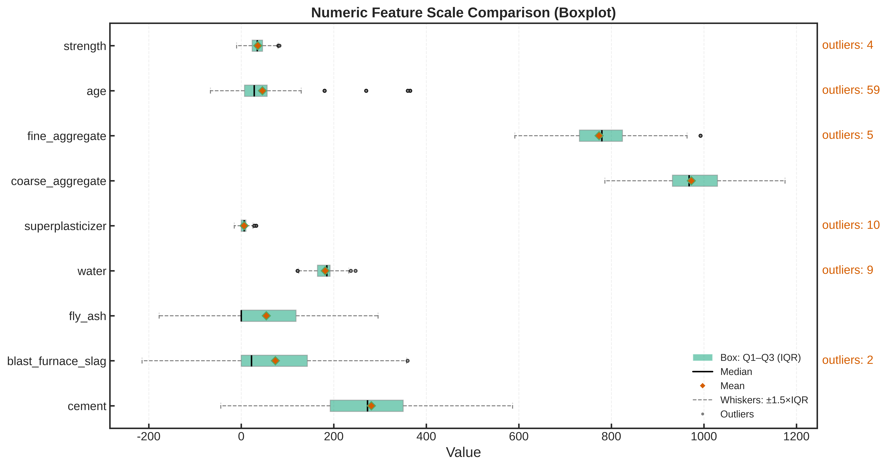
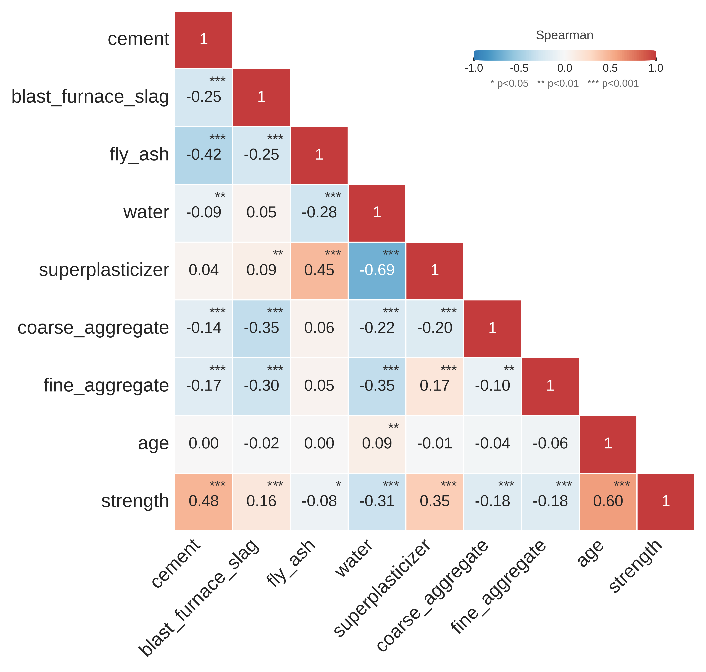
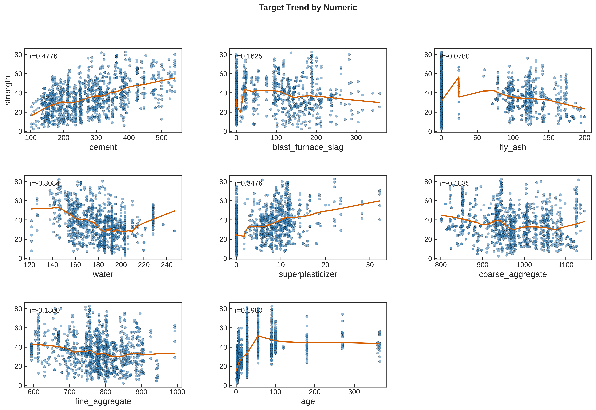
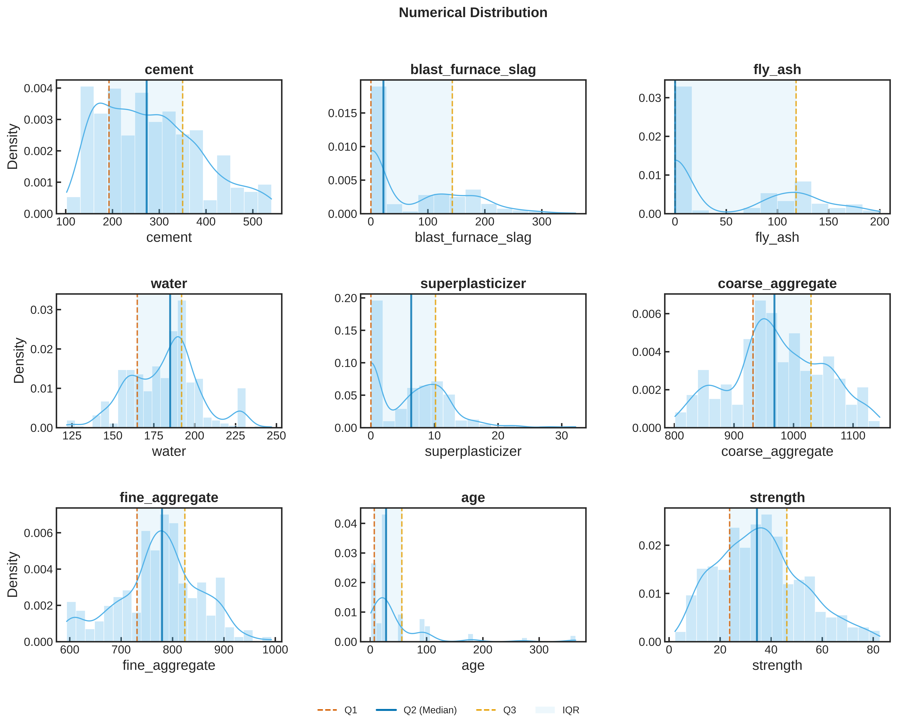
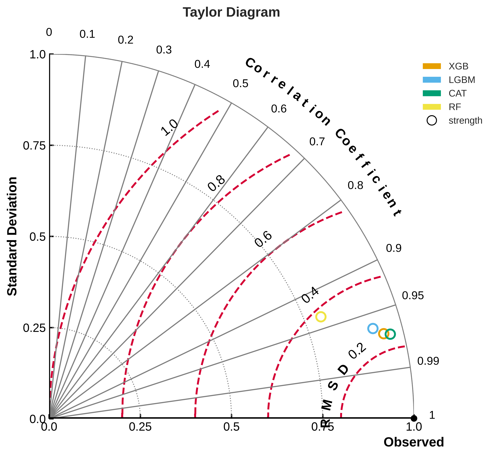
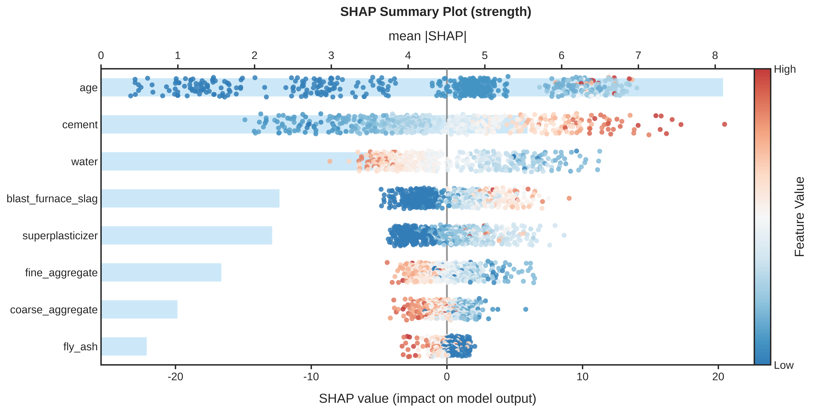

# 混凝土配比寻优：1030 条实验数据，找到最优配方

> 系列第 1 篇（综述）讲了六阶段服务链路。
> 这篇用 **Concrete Compressive Strength** 公开数据集完整跑一遍——
> 从原始数据到"水泥 451 kg、矿渣 237 kg、养护 77 天，预测强度 80.64 MPa"的最优配比。

---

## 问题背景

混凝土 28 天抗压强度由 8 个工艺参数（水泥、矿渣、粉煤灰、水、减水剂、粗骨料、细骨料、养护龄期）共同决定，关系存在明显的**非线性与交互效应**。常规分析路径的局限：

- **单变量回归**无法刻画多变量交互（如水泥 × 水 × 骨料级配的协同作用）；
- **正交实验**受限于组合数量与 28 天养护周期，一年只能试几轮；
- **文献经验公式**在原材料体系变化后即失效。

**研究问题**：给定 1030 条历史配比-强度记录，如何确定使抗压强度最大化的最优配比？

---

## 数据

数据集：UCI / OpenML **Concrete Compressive Strength**（[OpenML ID 44959](https://www.openml.org/d/44959)），1030 条记录、8 个输入特征、1 个输出。数据画像（节选）：

| 特征 | 含义 | 范围 | 缺失 |
|---|---|---|---|
| cement | 水泥用量 (kg/m³) | 102–540 | 0% |
| blast_furnace_slag | 矿渣用量 (kg/m³) | 0–359 | 0% |
| fly_ash | 粉煤灰用量 (kg/m³) | 0–200 | 0% |
| water | 用水量 (kg/m³) | 122–247 | 0% |
| superplasticizer | 减水剂用量 (kg/m³) | 0–32 | 0% |
| coarse_aggregate | 粗骨料用量 (kg/m³) | 801–1145 | 0% |
| fine_aggregate | 细骨料用量 (kg/m³) | 594–993 | 0% |
| age | 养护龄期 (天) | 1–365 | 0% |
| **strength** | **28 天抗压强度 (MPa)** | **2.3–82.6** | 0% |

无缺失值、无 ID 列、无常量列，可直接建模。

---

## 探索性数据分析（EDA）

**① 相关性热力图**：水泥与强度正相关（r ≈ 0.5），水与强度负相关（r ≈ -0.29）——符合工程直觉，但两两相关无法回答"8 参数如何组合最优"。

**② 目标-特征趋势图**：龄期 0–28 天强度快速上升、28 天后趋缓；且不同水泥用量下曲线斜率不同——**存在水泥 × 龄期交互效应**，这正是线性模型无法刻画的结构。

**③ 数值分布**：矿渣、粉煤灰、减水剂严重右偏（大量样本为 0），建模前需相应预处理。

---

## 多模型对比评估

在相同数据划分（5 折交叉验证）与同一评估指标（MAE）下对比 4 种模型，各模型经自动调参：

| 模型 | MAE (MPa) | 说明 |
|---|---|---|
| CatBoost | **2.56** | 数值特征友好，最优 |
| XGBoost | 2.71 | 集树集成，紧随其后 |
| LightGBM | 3.10 | 训练最快 |
| RandomForest | 4.83 | 强基线 |

预测-实测散点图展示模型整体拟合质量：

> 正式配置：5 折交叉验证、每模型 200 棵树、自动调参 30 轮——参数、指标、评估图全程记录，同一数据、同一划分、同一指标，模型间可比。

---

## 可解释性分析（SHAP）

将模型预测拆解为各特征贡献：

**① 全局特征重要性（mean\|SHAP\|）**

**养护龄期与水泥用量为双主变量**，显著高于其余 6 个特征（细骨料、用水量次之）；粉煤灰在该数据集上的作用相对有限。完整贡献排序见上图右侧条形图。

**② 单变量边际效应（SHAP dependence）**

水泥用量从 102 增至 540 kg/m³ 时，强度贡献近似线性上升，但不同龄期样本的斜率不同——**水泥 × 龄期的交互效应在模型内被显式建模**，与 EDA 阶段的观察一致。

**③ 单样本归因（waterfall）**：以预测强度最高的样本为例（龄期 270 天），龄期贡献 +11.9 MPa、水泥 +6.5 MPa、细骨料 +5.9 MPa，用水 -3.9 MPa、减水剂 -2.4 MPa——单条记录的预测可逐项拆解，便于向一线人员解释。

---

## 逆向设计：从目标 Y 反推最优 X

配比优化的真实问题是逆向的：**目标强度已知，求最优配比**。基于训练好的模型，在历史数据范围内做 200 次带约束智能搜索（水泥 102–540、用水 122–247 kg/m³）：

| 参数 | 建议值 |
|---|---|
| cement 水泥 | **451.0** kg/m³ |
| blast_furnace_slag 矿渣 | **236.8** kg/m³ |
| fly_ash 粉煤灰 | 3.3 kg/m³ |
| water 水 | **146.0** kg/m³ |
| superplasticizer 减水剂 | 26.4 kg/m³ |
| coarse_aggregate 粗骨料 | 1144.4 kg/m³ |
| fine_aggregate 细骨料 | 760.4 kg/m³ |
| age 养护龄期 | **77** 天 |
| **预测 28 天强度** | **80.64 MPa** |

对比样本中位数约 35 MPa → **提升约 130%**。

最优配比与工程常识的一致性：水泥用量处于高区间（占历史上限 84%）、矿渣高掺替代熟料、用水量偏低区间（水灰比小则强度高）、龄期 77 天偏长——方向均与 SHAP 主变量一致。

> 支持工艺约束：单变量范围约束（如"水泥 ≤ 400 kg/m³"）与跨列规则约束（如"水泥 > 400 时水灰比 ≤ 0.5"），违反约束的组合在搜索阶段直接剪枝。

---

## 预测验证

寻优配比在投入实验/生产前，用同一套模型做预测验证：**预测 28 天抗压强度 = 80.64 MPa**，与寻优预测完全一致——寻优与验证共用同一模型。

---

## 业务价值与局限

### 价值

1. 基于 1030 条历史记录，无需新增实验，即获得"历史最优 +130%"的配比建议；
2. 全链路可解释：SHAP 说明"为什么是龄期与水泥"，逆向搜索给出"具体如何调整"；
3. 全流程可追溯：每个环节留有实验记录，可随时重跑复核。

### 局限

1. 数据集为 1998 年前后的实验室数据，真实产线的骨料级配、外加剂体系更复杂，建议仅作为**配方初筛**，需小样验证；
2. 最优配比落在历史数据范围内——突破历史边界（如全新骨料体系）需补充实验数据。

---

## 想在自己的数据上试一次？

混凝土、食品、化工、制药、能源……同一套链路，换数据即可。把你的配比记录（Excel / CSV，可脱敏）发给我们，我们先用你的数据跑一遍，把结果拿给你看。

**如果你做的是食品 / 化工 / 制药 / 能源方向**——系列下一篇用葡萄酒理化数据演示（食品），再下一篇是电厂工况（能源）。

> 扫码关注公众号，每周一篇深度案例，回复"配比"获取更多混凝土配比优化的案例。
> 加作者微信，把你的数据脱敏发过来，我们看看能不能直接帮你跑通一次。
