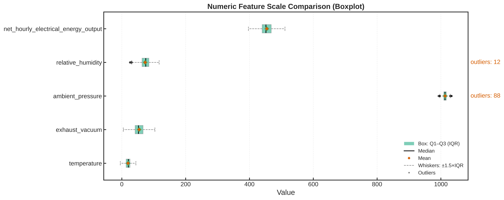
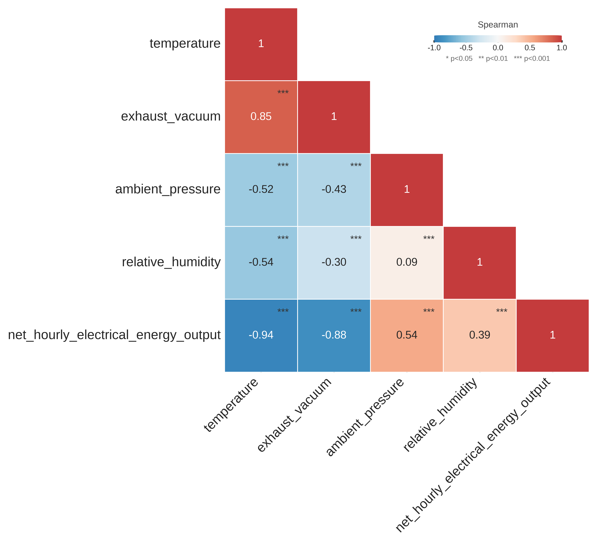
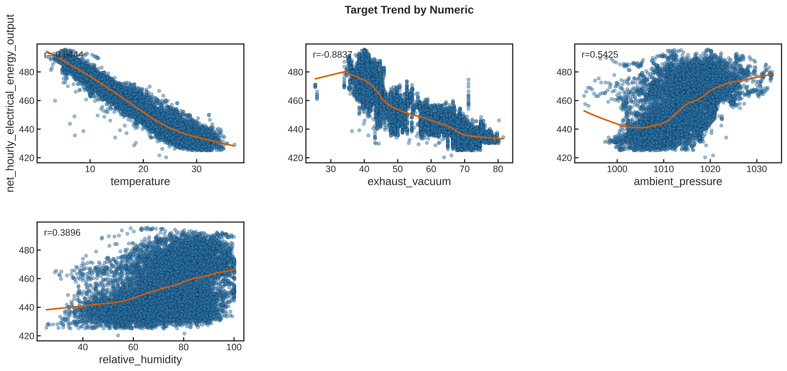
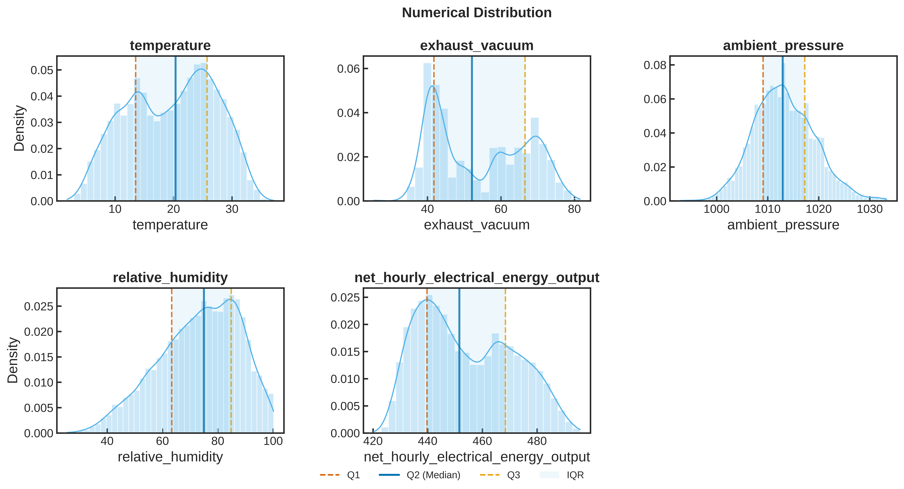
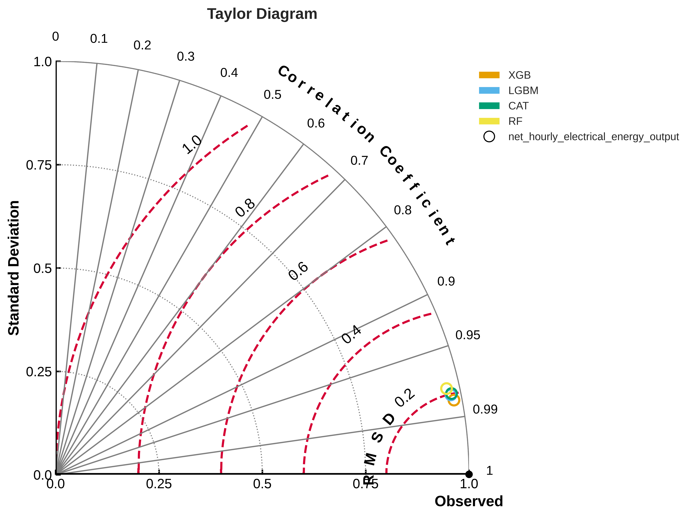
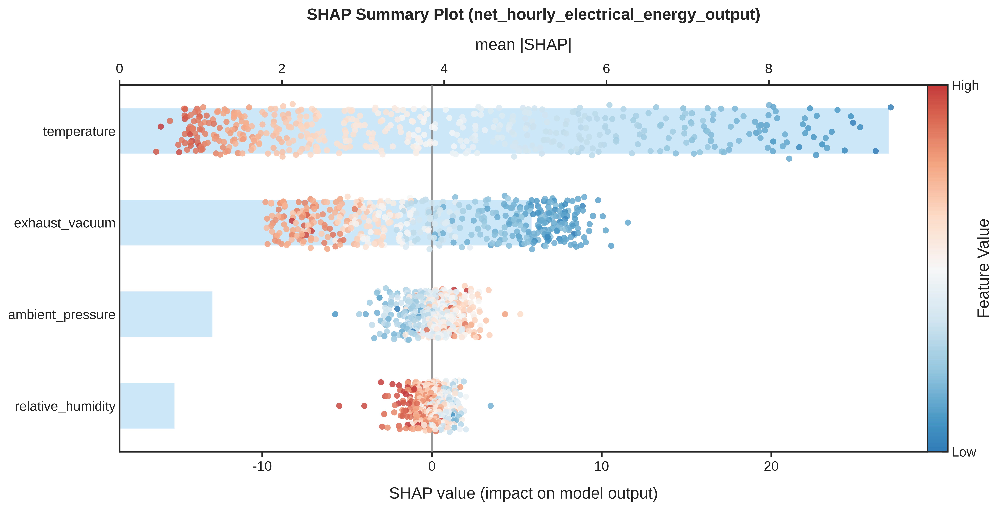
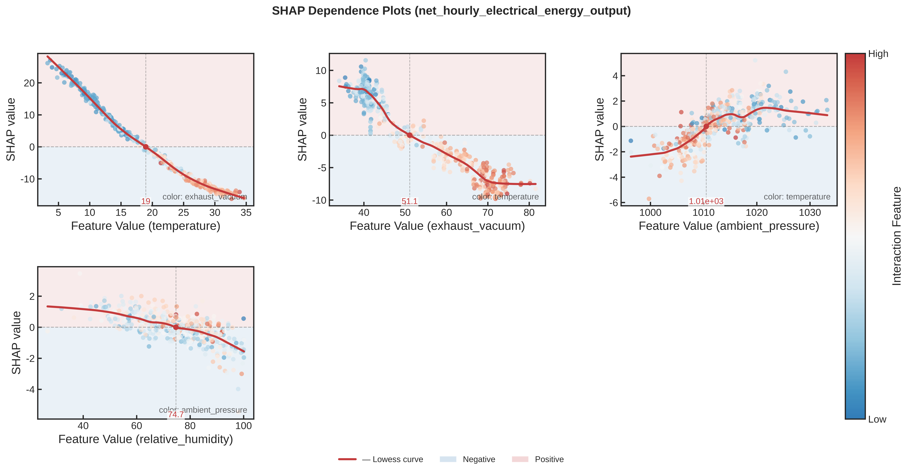

# 电厂工况的最优解：9568 条运行记录，温度是决定电力输出的第一变量

> 前两篇分别用混凝土（深度案例①）和葡萄酒（深度案例②）演示了完整链路。
> 这篇把链路搬到工业场景——**Combined Cycle Power Plant** 公开数据集：
> 9568 条电厂运行记录，4 个工况参数，回答能源行业的核心问题——
> **"同样的设备，什么样的工况组合能输出最多的电？"**

---

## 问题背景

某 420 MW 燃气联合循环电厂，6 年（2006–2011）积累 9568 条运行记录，每条含 4 个环境工况参数（环境温度、排气真空度、大气压、相对湿度）与净电能输出。常规分析路径的局限：

- **经验判断**只能定性（"天热了效率就掉"），无法量化"温度降 1℃ 多出多少电"；
- **实验设计（DOE）不可行**——环境工况不可控，无法主动设置实验条件；
- **厂家铭牌效率曲线**为设计值，设备实际运行多年后已偏离。

**研究问题**：环境工况是"给定"而非"可调"的，如何基于历史数据量化各工况对出力的影响，并用于调度决策？

---

## 数据

数据集：UCI **Combined Cycle Power Plant**（[UCI 数据集 294](https://archive.ics.uci.edu/dataset/294/combined+cycle+power+plant)），9568 条工况记录（6 年、每月 4 次采样）。数据画像：

| 参数 | 含义 | 范围 |
|---|---|---|
| temperature | 环境温度 (℃) | 1.81–37.11 |
| exhaust_vacuum | 排气真空度 (cm Hg) | 25.36–81.56 |
| ambient_pressure | 大气压 (mbar) | 992.89–1033.30 |
| relative_humidity | 相对湿度 (%) | 25.56–100.16 |
| **net_hourly_electrical_energy_output** | **净电能输出 (MW)** | **420.26–495.76** |

---

## 探索性数据分析（EDA）

**① 相关性热力图**：

- 环境温度与出力**负相关 r ≈ -0.95**——压倒性的第一相关；
- 排气真空度与出力负相关 r ≈ -0.87（真空度高、排气背压低反而出力低，反直觉但真实）；
- 温度与真空度正相关 r ≈ 0.84——**环境温度通过影响排气真空度间接影响出力**，构成完整的影响链。

**② 目标-特征趋势**：温度对出力的边际效应近似线性——每升 5℃，出力降约 10–15 MW，给出可量化的"温度罚则"。

**③ 数值分布**：4 个参数分布干净、无明显离群，可直接建模。

---

## 多模型对比评估

在相同数据划分（5 折交叉验证）与同一评估指标（MAE）下对比 4 种模型（正式配置：200 棵树、调参 30 轮）：

| 模型 | MAE (MW) | 说明 |
|---|---|---|
| XGBoost | **2.24** | 集成树，最优 |
| LightGBM | 2.47 | 训练最快 |
| CatBoost | 2.51 | 数值特征友好 |
| RandomForest | 2.75 | 强基线 |

预测-实测散点图展示拟合质量：

> 该数据集为"低维高样本"典型（4 特征 × 9568 样本）——树模型经自动调参后，误差较线性模型通常再压低 5–10%。

---

## 可解释性分析（SHAP）

**① 全局特征重要性（mean\|SHAP\|）**

结论（完整排序见上图右侧条形图）：

1. **环境温度是第一主变量**，贡献显著高于排气真空度，更是远超大气温与湿度——"温度决定电厂效率"在数据上得到量化确认；
2. 相对湿度对出力几乎没有影响——运维手册中关于湿度的部分说法在该数据集上缺乏支持；
3. 温度 → 排气真空度 → 出力的影响链，与 EDA 阶段的相关结构一致，在模型中形成显式路径。

环境温度的边际效应（SHAP dependence）：

---

## 逆向设计：从目标 Y 反推最优 X

与混凝土、酿酒不同，环境工况不可"调节"——逆向搜索的价值在于回答：**"未来天气已知时，怎样的工况组合对应最大出力？"**（300 次智能搜索）：

| 参数 | 建议值 |
|---|---|
| temperature 环境温度 | **3.25℃** |
| exhaust_vacuum 排气真空度 | **28.05** |
| ambient_pressure 大气压 | **1029.29** |
| relative_humidity 相对湿度 | 80.2% |
| **预测净电能输出** | **492.34 MW** |

对比样本中位数 451.55 MW → **提升 9.0%**。

最优工况的物理合理性：温度贴近历史最低（SHAP 第一变量拉到极限）、低真空度（与负相关方向一致）、大气压接近历史高点（高气压 → 高空气密度 → 燃烧充分）——湿度本身贡献微弱，取值不影响结论。

**更重要的应用**：调度员依据天气预报（如"明日 14 时 32℃"）预测各时段出力，提前安排燃气轮机开机台数与检修窗口——"工况感知的调度优化"。

---

## 预测验证

寻优工况组合在排程前，用同一套模型做预测验证：**预测净电能输出 = 492.34 MW**，与寻优预测完全一致——寻优与验证共用同一模型。

---

## 业务价值与局限

### 价值

1. 量化"温度罚则"（每升 5℃ 出力降 10–15 MW），可直接写入调度规程；
2. 天气已知 → 出力可预测 → 开机计划提前排，避免"高温天电网要电、电厂给不出"的被动；
3. 预测低出力时段安排停机检修，机会成本最低。

### 局限

1. **环境工况不可控**——"最优天气"不可实现，但其方向性结论（低温、低真空、高气压）对选址、设计、采购有指导意义；
2. 数据仅含 4 个环境参数——负荷、燃料热值、设备老化度不在其中，模型输出应结合 DCS 实时数据使用。

---

## 想在自己的数据上试一次？

能源、电力、机械运维……同一套链路，换数据即可。把你的运行记录（Excel / CSV，可脱敏）发给我们，我们先用你的数据跑一遍，把结果拿给你看。

**系列最后一篇**：21263 条超导材料数据——81 维特征的高维场景，看如何在"高维数据里找到关键化学特征"。

> 扫码关注公众号，回复"电厂"获取更多能源方向的数据分析案例。
> 加作者微信，把你的数据脱敏发过来，我们看看能不能直接帮你跑通一次。
