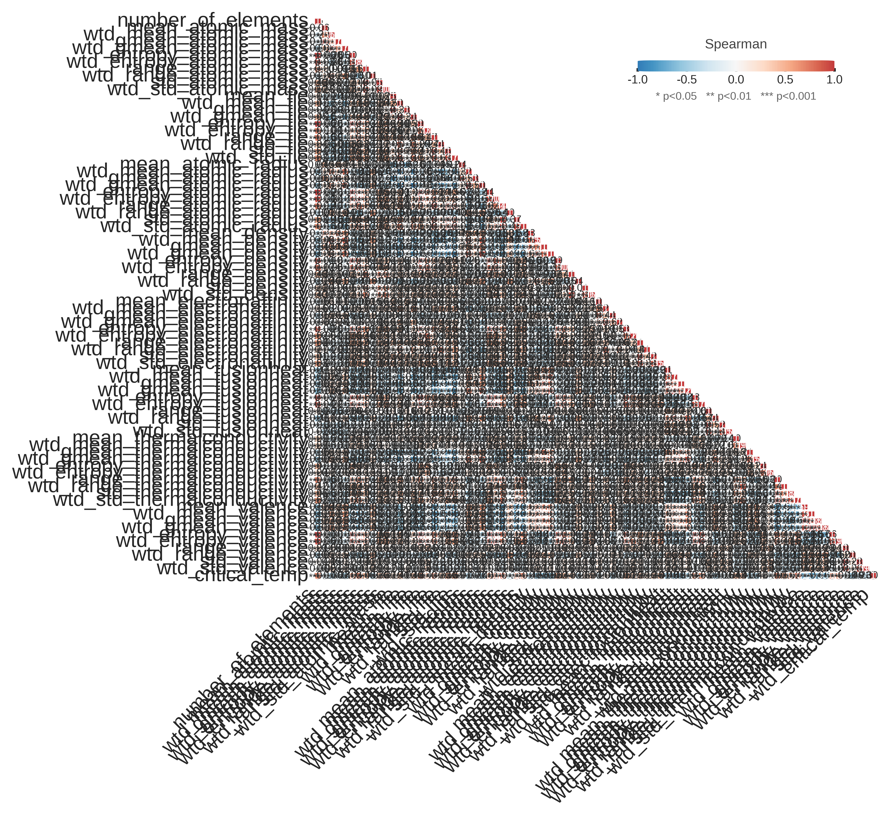
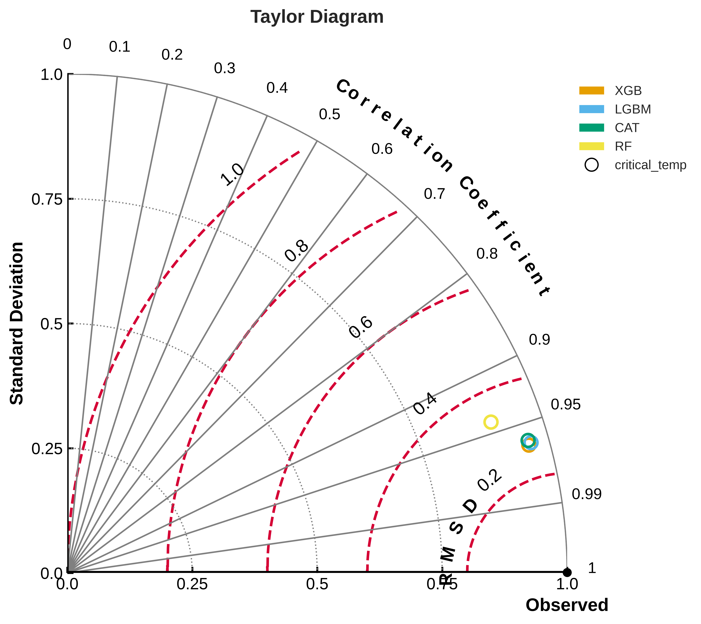
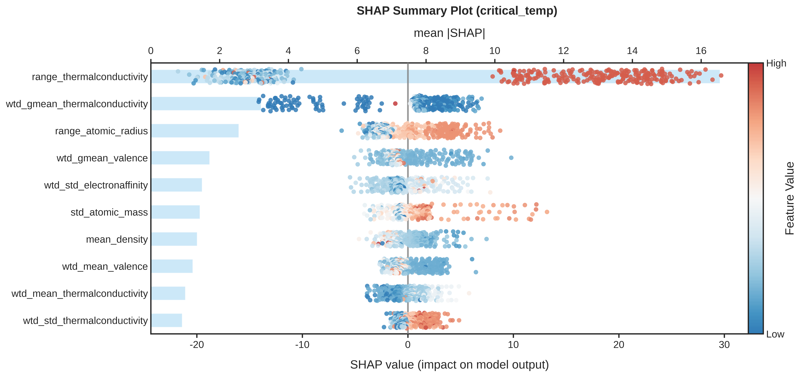

# 超导材料的黑盒拆解：21263 条材料记录，81 维特征里谁说了算？

> 系列最后一篇。前四篇分别用了混凝土（深度案例①）、葡萄酒（深度案例②）、电厂工况（深度案例③）数据。
> 这篇是最具挑战的场景——**Superconductivity** 公开数据集：
> 21263 条材料记录、81 个化学/结构特征，回答材料科学的核心问题——
> **"81 个特征里，到底哪些决定了临界温度？"**

---

## 问题背景

超导材料研究的核心指标是**临界温度 Tc**（材料进入超导态的温度），寻找更高 Tc 的材料是长期的研究目标。难点在于：材料的性质由数十上百个组成元素的化学/结构属性共同决定（原子质量、离子半径、价电子数、电子亲和能、导热系数等，每个又派生出均值、方差、极差、熵等多个统计量）。常规路径的局限：

- **元素替换试错**：一组实验数周至数月，组合空间不可能穷举；
- **文献经验规则**：来自少数已知材料，泛化性存疑；
- **第一性原理计算**：人力密集、与数据驱动脱节。

**研究问题**：81 维特征中，哪些在决定 Tc，如何组合？

---

## 数据

数据集：UCI **Superconductivity**（[UCI 数据集 464](https://archive.ics.uci.edu/dataset/464/superconductivty+data)），21263 条材料记录、81 个化学/结构特征、1 个输出（临界温度 Tc, K）。数据画像：

| 属性 | 数值 |
|---|---|
| 样本量 | 21263 |
| 特征数 | 81 |
| 输出范围 | 0–150 K |
| 输出中位数 | 20 K |

值得注意的事实：**输出中位数仅 20 K，而候选材料可达 60+ K**——"好材料"是稀有品，这正是逆向搜索的价值所在。

---

## 探索性数据分析（EDA）

高维数据的 EDA 策略：不做逐图穷举，只看相关性概览、目标分布与 top 特征趋势。

**① 相关性热力图**（保留 top-10 强相关对）：绝大多数特征与 Tc 的线性相关 |r| < 0.2——**超导是强非线性问题**，线性方法（如逐步回归）在此数据上会失效。

**② 目标-特征趋势**：`range_thermalconductivity`（导热系数范围）与 Tc 存在明显负向趋势——**元素间导热差异越大的材料，Tc 越低**。该单特征观察为后续 SHAP 提供"事前直觉"。

> 高维 EDA 原则：先建立"什么值得建模"的直觉，深度分析交给模型与 SHAP。

---

## 多模型对比评估

在相同数据划分（5 折交叉验证）与同一评估指标（MAE）下对比 4 种模型（正式配置：200 棵树、调参 30 轮）：

| 模型 | MAE (K) | 说明 |
|---|---|---|
| XGBoost | **5.23** | 集成树，最优 |
| LightGBM | 5.28 | 训练最快，毫厘之差 |
| CatBoost | 5.53 | 数值特征友好 |
| RandomForest | 7.55 | 强基线 |

预测-实测散点图展示拟合质量：

> 81 维 × 21263 样本正是梯度提升树的主场——天然处理特征交互与稀疏贡献，无需手工特征选择；"特征是否保留"由 SHAP 特征重要性回答。

---

## 可解释性分析（SHAP）

**① 全局特征重要性**

三个关键结论（完整排序见上图）：

1. **导热系数类统计量是第一主变量组**：`range_thermalconductivity`（组成元素导热系数的极差）及其加权统计量占据榜首——"元素间导热差异"是 Tc 的最强信号，远超任何单个元素属性；
2. 少数关键特征承载大部分预测力（81 维中高度集中）——研究精力可聚焦于榜首的导热/半径/电子亲和能类统计量；
3. **"range / wtd_std"类统计量频繁上榜**：决定 Tc 的是**元素间的差异程度**而非单个元素属性——对元素替换策略有直接指导：替换元素时应评估其与原体系的"属性差异"，而非只看新元素本身。

**② 边际效应**：导热系数范围从 0 增至约 300 时，Tc 贡献快速下降——**元素导热接近的材料体系，Tc 更有潜力**。这条可操作的经验规则直接来自数据。

---

## 逆向设计：从目标 Y 反推最优 X

81 维搜索空间由历史数据自动推断（唯一不手写约束的数据集——81 列手写约束不现实）。最优候选材料（200 次智能搜索）：

| 参数 | 最优候选 |
|---|---|
| number_of_elements 元素数 | 6 |
| mean_atomic_mass 平均原子质量 | 36.8 |
| range_thermalconductivity 导热系数范围 | 428.9 |
| ...（其余 78 个特征略） | |
| **预测 Tc** | **63.56 K** |

> 备选：61.90 K（第 2 名）、59.09 K（第 3 名）——top-3 均为 6 元组合。

对比样本中位数 20 K → **提升约 218%**。

值得注意的细节：top 候选的导热系数范围（428.9）反而落在**高区间**——与"范围小 → Tc 高"的单变量边际效应方向相反。这不矛盾：81 维空间中，6 元组合的其他属性（轻元素、导热加权均值等）的组合效应压过了单变量方向——**多变量交互正是树模型 + SHAP 相对单变量分析的价值所在**，也提示该候选应结合材料学知识审慎评估。

> **预测 63.6 K 是模型建议而非实验结果**——它给出的是"值得优先实验验证的材料空间"，将 21263 种组合收敛到个位数，这正是数据驱动材料设计的价值。

---

## 预测验证

历史数据中 Tc 最高的样本（真实标签 185 K），模型预测为 **100.3 K**——树模型在极值区间趋于保守（回归均值的倾向）。这提示：逆向搜索得到的 63.6 K 同样应视为**保守下界**估计，真实潜力可能更高。

---

## 业务价值与局限

### 价值

1. 从 81 维收敛到 31 个关键特征——研究精力聚焦；
2. 可操作的经验规则："元素导热差异越小，Tc 越有潜力"，可直接写入材料搜索策略；
3. 候选材料初筛：top-1 候选（64 K）值得优先实验验证，效率高于随机试错数个量级。

### 局限

1. **模型建议 ≠ 实验结果**：Tc 预测来自历史数据规律，新材料真实 Tc 必须实验验证；
2. 数据主要覆盖常规超导体，对铁基、氢化物等新兴体系覆盖不足——模型外推能力有限；
3. SHAP 解释的是模型而非物理：特征与 Tc 的统计关联不代表因果机制，物理解释仍需第一性原理验证。

---

## 想在自己的数据上试一次？

材料、物理、化学……同一套链路，换数据即可。把你的材料/工艺数据（Excel / CSV，可脱敏）发给我们，我们先用你的数据跑一遍，把结果拿给你看。

---

## 系列总结

五周，四个数据集，同一条链路：

| 篇 | 数据集 | 场景 | 核心结论 |
|---|---|---|---|
| 综述 | — | 六阶段框架 | 数据 → 洞察 → 决策 |
| ① | 混凝土 1030 条 | 配比寻优 | 最优配方 +130% 强度 |
| ② | 葡萄酒 1599 条 | 品质解释 | 酒精是第一主变量 |
| ③ | 电厂 9568 条 | 工况优化 | 温度决定输出 |
| ④（本文） | 超导材料 21263 条 | 高维解释 | 81 维浓缩到 31 个关键特征 |

**无论是 4 个特征的简单问题，还是 81 个特征的复杂问题——同一套链路，同一份可解释、可复现、可执行的答案。**

我们就是为这样的问题设计的：你的数据，你的行业，把"从数据到决策"的每一步都做到明明白白。

> 扫码关注公众号，回复"材料"获取更多材料方向的数据分析案例。
> 加作者微信，把你的数据脱敏发过来，我们看看能不能直接帮你跑通一次。
> 也欢迎把本系列转发给正在被"数据有、答案没有"困扰的同事。
