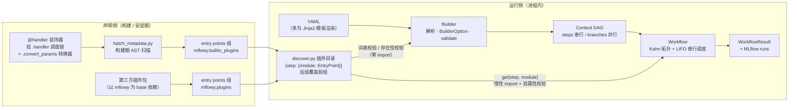
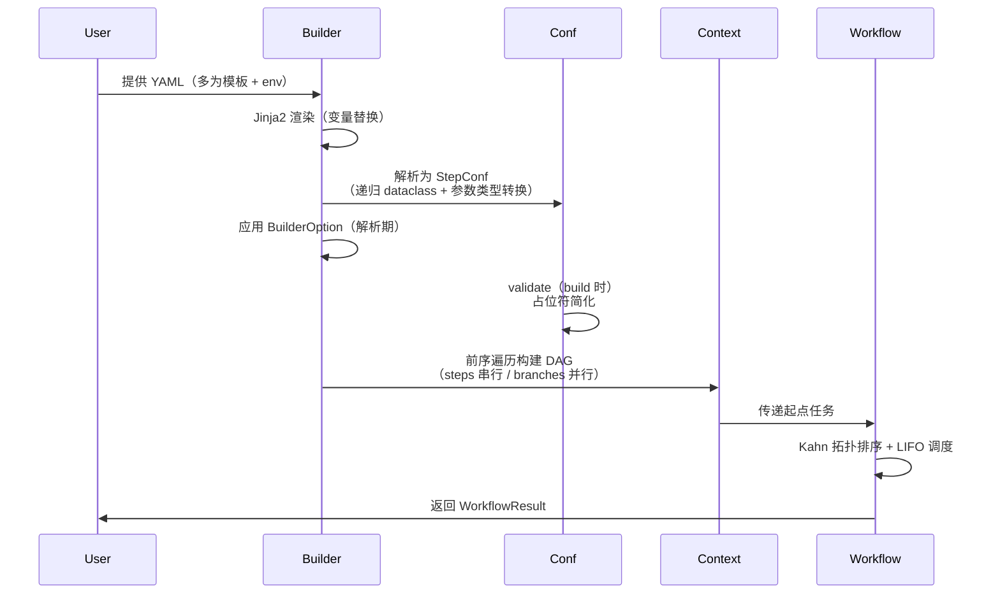

# mflowy-driver — 插件化 DAG 内核

**一个轻量的、能力全部以插件存在的、由 YAML 编排的 DAG 编译与调度内核。**

职责一句话：构建期把 YAML 图（多为模板或 LLM 生成）编译成 Context DAG，运行期串行调度插件目录中的 handler——计算发生在插件内，内核只组合与调度，并把每次运行装配成可追溯的实验记录（WorkflowResult + MLflow runs）。远程执行由 JobProvider（mcp 包）把整个工具抬到远端，driver 本体始终进程内。

> 事实以代码为准，本文只沉淀心智模型、设计意图与赌注。`mflowy/driver/` 即本包。

## 定位与边界

四个目标词各自排除了一类方案：

| 目标 | 排除项 |
|------|--------|
| 轻量 | 事件总线、生命周期状态机、反射式依赖注入、热重载 |
| 插件自主注册 | 手工登记表、中心化 wiring、为注册写配置/CLI |
| YAML 编排 | Python 代码编排、图 DSL、GUI 建图 |
| DAG 执行 | 通用插件框架、长驻服务运行时、动态装卸 |

**非目标**（范围选择，非缺陷）：并行执行——调度器（`workflow.py` LIFO 拓扑序）刻意串行；能力动态装卸——`discover` 目录在进程内 `@cache` 单向物化，不支持运行期装卸。

## 设计哲学：内核冻结，生态外挂

一句话：**内核只做编译与仲裁，能力是插件、身份是声明、安装即注册；图是从能力目录组装出的一等工件。**

谱系：本设计与 cordis、pi、dsh 等以插件为核心的架构一脉相承——封闭内核 + 声明式注册（安装即注册，无注册中心）+ 目录与解析分离 + 版本化 SDK 让生态自行生长。pi 的 extension/skill 生态（包安装后自动进入工具目录）是这一模式最直接的参照；mflowy 把同样的赌注押在 ML 工作流上：**能力目录由包管理器维护，内核只消费目录**。

| 命题 | 内容 | 换来的东西 |
|------|------|-----------|
| 1. 内核冻结，能力皆插件 | 内核不实现任何业务能力（内置能力也在独立包 `mflowy-builtin-plugins`，与第三方同构）；定制全部走构建期变换（placeholder 简化、BuilderOption、Jinja2 渲染），调度内核保持纯调度 | 内核可独立测试、独立演进；内置能力即第三方插件的活参考实现（持续吃狗粮） |
| 2. 身份即声明 | 节点地址是 entry point name `step.module`，不是函数名或全局 ID；声明住在包元数据（pyproject），不住在代码 | 词表可枚举、可校验、可审计、可被外部扩展；LLM 与人共享同一图语言 |
| 3. 安装即注册 | uv/pip 装上即进入目录，卸载即退出；无 register CLI、无本地状态文件 | 环境可复现（K8s Job 容器与本地天然一致），插件分发零额外机制 |
| 4. 目录与解析分离 | 目录查询（`discover`/`has`/`list_all`）纯元数据零 import；import 惰性发生在 `get(step, module)`，且以 `@handler` 双属性校验声明一致性 | 缺依赖的模块照常列出（而非静默消失）；坏声明（忘标 `@handler`、value 路径写错）fail-loud |
| 5. 边按类型寻址 | `prev(step)` 按能力族检索最近上游，而非点名引用具体节点 | 换 module 不改下游连线（XGB→LGBM 只改一行）——ML 实验的核心诉求；代价：边到运行期才解析，参数校验延迟（见「设计赌注」#3） |
| 6. 图住配置，代码住目录 | 能力（目录项）与图（YAML 工件）分离，派生两类角色：能力作者添目录项，图组装者（人、模板、LLM）拼 YAML | 两类演化互不阻塞，driver 本质是两个角色之间的编译器 |
| 7. DAG 是实验计划书 | 串行调度、无增量跳过：每次运行必留痕，复用旧结果是显式 `run_id` 引用而非静默缓存；观测（mlflow 尾链）织入内核 | agent 的控制流永远可预测；实验即记录 |

命题 1/6/7 合称"编译器前端"：全部组合发生在执行前，运行期只剩纯调度。

## 架构总览



- **左侧**只发生在构建/安装时刻：能力作者写 pyfunc + `@handler`，构建期 hook 扫描生成 entry points，身份 `step.module` 随包元数据分发。
- **右侧**是进程内全部：目录一次物化（`@cache`），Builder 编译期对目录校验词表与模块存在性（零 import），调度期按节点惰性加载并校验。
- **覆盖语义**：`mflowy.plugins` 组按声明覆盖 `mflowy.builtin_plugins` 同名项（info 级日志），同组撞名 warning——定制内置行为不需 fork。

## 一次执行的生命周期



| 阶段 | 代码 | 说明 |
|------|------|------|
| 模板渲染 | `builder.py: _load_yaml` | `{{ var }}` 注入 `env` 参数；生产入口多为模板而非手写 YAML（见「模板与片段组合」） |
| 配置解析 | `config.py: StepConf.__post_init__` | 递归 dataclass 化，同时触发该模块的参数类型转换（惰性 `get_post_init`） |
| 配置变换 | `builder_options.py` | BuilderOption 逐 step 应用，发生在 `Builder.__init__` 解析期 |
| 验证/简化 | `config.py: validate` | `build()` 触发；空占位删除、单层嵌套提升 |
| DAG 构建 | `builder.py: _build_tasks` | 前序遍历，串行 `steps` 链接、并行 `branches` 分叉；模块存在性在此校验（对目录，零 import） |
| 调度执行 | `workflow.py: run` | 见下 |

运行期语义：

- **Kahn 入度 + LIFO 就绪栈**：深度优先，刚解锁的下游先跑、独立分支按声明逆序。总时间不变（串行求和），但下游结果更早产出。
- **通道边界**：节点 `print`（stdout）被 `capture_prints` 捕获进 `NodeResult.output`，`logger`（stderr）走过程诊断。
- **失败语义**：任一节点异常即整图中止（`stop_on_error` 可按节点放宽），`WorkflowResult.status=failed`、error 定位到 `step.module.name`；无重试、无续跑。
- **结果结构**：实验名/ID + 逐节点 run_id/状态/输出 + graph 三视图（name/tree/mermaid，默认 mermaid）。

## 核心机制

### 自主注册（最核心的设计）

新插件 = 一个 pyfunc + 一行装饰器，四处自动生效：

```python
@handler(inject_df, df_diff)   # 能力作者只写这两行
def common_filter(...) -> pd.DataFrame: ...
```

1. **身份声明**：包构建期 `hatch_metadata.py` AST 扫描 `@handler` 函数生成 `[project.entry-points."mflowy.builtin_plugins"]`——name 即身份 `step.module`（目录→step 映射在 `_STEP_OF_DIR`，新能力族漏配构建即报错；纯 AST 零 import，构建环境无 torch 也能构建）
2. **能力标记**：`handler.py: @handler` 织入中间件链后把 `.handler`（调度链）与 `.convert_params`（参数转换器）挂到函数属性上，装饰器返回原函数（直调不破）；`mlflow_log` + `stop_on_error` 强制尾链（`builtin_middleware.py`），每个 handler 必在 mlflow run 内执行
3. **目录与解析**：`discover.py` 按序读两组 entry points（`mflowy.builtin_plugins` 内置 + `mflowy.plugins` 第三方），`discover()/has()/list_all()` 纯元数据零 import；`_load_fn` 惰性 import 并以双属性校验声明一致性，坏声明 fail-loud
4. **用户文档**：`module.py: get_module_info` 内省 `Annotated[T, "描述"]` → MCP `tools/list` schema——MCP schema 即 API 文档

**editable 陷阱**：entry points 元数据在 `uv sync` 时生成，新增插件模块后必须重跑 `uv sync` 才会出现在 `list_modules`。

### 类型注解单源

`Annotated[T, "描述"]` 是全引擎的契约单一事实源，四处消费（见上）。签名约定：裸类型参数 = 中间件注入（如 `df`），`Annotated` 参数 = 用户可配（`get_module_info` 据此过滤）。参数转换器支持 union 中任意 Enum 子类（值/名双形式）与超参搜索空间类型。

### Context = 数据节点（注意命名）

`Context` **不是**依赖注入意义上的"环境容器"——它是 DAG 任务节点：持有 `conf`、`result`、双向依赖边（`_prevs` 溯源 / `_nexts` 调度）。

数据依赖经 `ctx.prev(step)` 声明：BFS 向上游搜索指定类型的最近前置（`max_depth=20` 兜底），命中即消费其 `result`，**并写血缘 tag**（`context.py: _PATH_TAG_KEY = "mflowy.input_steps"`）——副作用不可撤销但全程可追溯。

`required=True` 时找不到前置抛 `PreviousContextNotFoundError`；`ContextVar` 计数器保证并发 `Builder.build()` 编号隔离。

### 中间件链

注册时一次性织入：`@handler(mw1, mw2)` → `mw1 → mw2 → mlflow_log → stop_on_error → handler`。中间件两处：

- **内核默认尾链**：`driver/builtin_middleware.py`（mlflow_log / stop_on_error）——装饰器编译期依赖，故必须同包
- **插件侧注入器与观测**：`mflowy/builtin_plugins/middlewares/`（`Get*` 数据访问 + `inject_*` 注入 + `log_*` 领域日志）——随能力族演化，是插件 SDK 的一部分

### 模板与片段组合

生产入口几乎不是手写 YAML，而是 **Jinja2 模板（mcp 包 `templates/`）+ `env` 注入**。片段可再加工后跨工具复用：`explanation` 工具复用 `modeling` 的 `modeling_steps_yaml` 片段——Builder 解析 → `prune_model_step` 改写（model 步替换为 loader）→ `serializer.steps_to_yaml` 重新序列化 → 注入另一张模板。`serializer.py: _plain`（Enum→名、dataclass→dict）与参数转换器构成 **YAML 往返闭环**，配置因此是可生成、可改写、可再注入的一等公民。

### BuilderOption：StepConf → StepConf

- **工厂期与闭包期分离**：`prune_model_step` / `resume_model_step` 创建 option 时一次性完成 model 参数解析 + MLflow 查询，返回的闭包只做查表改写——应用期无外部调用。
- **语义分工**：`prune_model_step` 未命中即剪枝、`resume_model_step` 未命中保持原状继续训练——覆盖"复用旧实验"的两种形态。
- **结构剪枝不算 Option**：`prune_x_transformer_step` 需看 nexts 才能判定下游是否消费 transformer，故内联在 `_parse_step_dicts`。
- **只编译不运行**：`builder.build(preview=...)` 不调 `run()`，validate 类工具借此做编译检查（模块存在性校验 + mermaid 预览）。

## 插件 SDK 速览（第三方作者）

以 mflowy 为 base 依赖，声明 entry points 即成插件：

```toml
[project]
name = "mflowy-extra"
dependencies = ["mflowy"]   # driver 的 @handler 与注入器契约即 SDK

[project.entry-points."mflowy.plugins"]
"load.super_csv" = "mflowy_extra.loaders:super_csv"   # name = step.module
```

```python
from mflowy.driver.handler import handler
from mflowy.builtin_plugins.middlewares import inject_df


@handler(inject_df)  # 复用内置注入器；新 step 族需自带 Get*/inject* 对
def super_csv(df, **params): ...
```

- 安装即注册：`uvx --from "mflowy[modeling]" --with mflowy-extra mcpSrv`；镜像定制走 `--build-arg MFLOWY_EXTRA_MODULES`
- 参考实现：`mflowy-builtin-plugins` 包（含构建期扫描 hook，抄走改 group 即可）
- SDK 面 = `driver/handler.py` 装饰器 + `driver/builtin_middleware.py` 尾链 + `builtin_plugins/middlewares/` 注入器；破坏性变更受 CHANGELOG 语义化版本约束
- 扩展单元 = step + 模块 + 注入器：全新 step 族的作者参照 `getters.py` 为自己的族写 `Get*/inject*` 对，否则模块拿不到上游数据

## 设计赌注与已知张力

1. **MLflow 深耦合**：`workflow.py`（setup/run）、`context.py`（血缘 tag）、`builtin_middleware.py`（默认尾链）三处直连观测层——"轻量引擎"与"MLflow 唯一观测层"叠加的结果（命题 7 的代价）。若未来抽独立引擎，`context.py` 血缘写点是唯一深的缝。
2. ~~**注册静默丢失**~~ **已解决**：entry points 元数据目录——查询零 import（缺 extra 的模块照常列出，`get_module_info` 时才暴露不可导入），加载才 import 且坏声明直接报错，构建期另有 AST 扫描双重把关。
3. **参数校验时机**：参数名错误要到执行到该节点才 TypeError；类型转换已在解析期。解析期 keys 比对是候选增强。
4. **`module.py` 的 `eval(annotation)`**：解析字符串注解，仅处理本进程注册的函数；换 `typing.get_type_hints` 可收敛。

## 扩展点速查

| 需求 | 动作 |
|------|------|
| 新插件（内置） | `packages/builtin_plugins/mflowy/builtin_plugins/<step>/**` 建 `.py` + `@handler(...)`，零配置，`uv sync` 后生效 |
| 新能力族（新 step） | `hatch_metadata.py: _STEP_OF_DIR` 加目录→step 映射 + 为该族写 `Get*/inject*` 注入器对（`middlewares/getters.py` 范本） |
| 第三方插件 | 声明 `[project.entry-points."mflowy.plugins"]`，name 格式 `step.module`（见「插件 SDK 速览」） |
| 修改/剪枝配置 | 写 `BuilderOption`（`StepConf → StepConf`），`Builder(..., opt)` 传入；结构剪枝（看下游）走 `StructuralRule`，`Builder(..., structural_rules=...)` 传入——契约在内核，实现随词汇主人（builtin 的 model/step_options.py 是范本） |
| 新横切关注点 | builtin_plugins `middlewares/` 建 `log_*` 或功能中间件，装饰器引用 |
| 查询已注册能力 | `discover.py: list_all()/has()` / MCP info 工具（list_modules / get_module_info） |
| 复用/改写另一工具的 steps 片段 | Builder 解析 + BuilderOption 改写 + `serializer.steps_to_yaml` 再注入（见「模板与片段组合」） |
| DAG 可视化 | `Workflow.__repr__` 三视图（name/tree/mermaid），mermaid 为默认 |

## 相关文档

- 能力目录与注入器契约：[mflowy-builtin_plugins README](../builtin_plugins/README.md)
- 引擎消费方（MCP 工具 / JobProvider / 遥测）：[mflowy-mcp README](../mcp/README.md)
- 仓库级导航与规约：[AGENTS.md](../../AGENTS.md)
